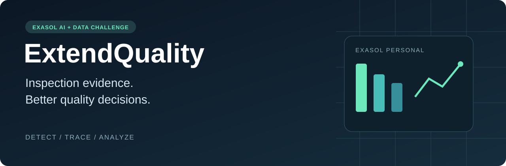
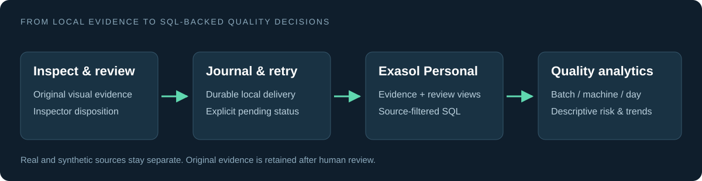

<p align="center"></p>

<p align="center">
  <strong>Industrial visual inspection · Traceable decisions · Exasol quality analytics</strong><br>
  Exasol AI + Data Challenge 2026 — Predict, Detect &amp; Optimize
</p>

<p align="center"><a href="https://github.com/prajeetjoshua-hub/ExtendQuality_Exasol/actions/workflows/ci.yml"></a></p>

<p align="center">
  <a href="RUN_GUIDE.md">Run locally</a> ·
  <a href="docs/JUDGE_WALKTHROUGH.md">Judge walkthrough</a> ·
  <a href="docs/exasol-architecture.md">Architecture</a> ·
  <a href="submission/README.md">Submission checklist</a>
</p>

## From one inspection to a batch-level decision

An inspection result is useful. A traceable history of results can tell a quality team where to investigate next.

**ExtendQuality connects visual inspection to Exasol Personal:** retain the original evidence, record the inspector's final decision, compare batches and machines, and surface changes in rejection rates. Every summary is backed by SQL, with unresolved cases and synthetic demonstrations explicitly separated.

Industry feedback shaped our direction: a bearing can look acceptable yet fail to rotate. The existing bearing prototype demonstrates the visual workflow; our next application will target selected **static visual and dimensional quality characteristics** of a manufactured product. Product selection and industrial validation remain research milestones. We do not claim functional bearing testing or a universal defect model.

## What you can run today

| Capability | Available now |
|---|---|
| Exasol Personal on a local Docker deployment | Schema, SQL views, queries and connection health |
| Batch quality analytics | Counts, rejection rates, daily trends and transparent triage recommendations |
| Reproducible analytics demonstration | 840 deterministic synthetic records; no photographs, model download or paid API required |
| Traceable inspector decisions | Accept/Reject changes the effective disposition; original evidence remains unchanged |
| Failure recovery | Local durable queue and explicit retry after database recovery |
| Existing visual prototype | OpenCV image checks, optional local bearing classifier and selective Gemini explanation |
| New static-product model, dimensional metrology, physical rejection | **Planned — not implemented or validated** |

**Submission status:** repository, run documentation and the ≤3-minute demo video are prepared. The pitch deck is team-supplied and remains to be added; see the [deliverable tracker](submission/README.md). This is a working development submission, not an industrially certified product.

## Exasol is the analytics platform



1. **Preserve evidence.** `INSPECTIONS` stores the original result, source, identity, model version and UTC timestamp.
2. **Record decisions.** `HUMAN_REVIEWS` stores the latest dated review. Local review events preserve the sequence of changes.
3. **Query effective quality decisions.** `EFFECTIVE_INSPECTIONS` gives human decisions precedence without overwriting model evidence.
4. **Compare batches and time.** SQL aggregates feed the dashboard's counts, daily trends and documented risk policy.

SQLite is the capture journal and delivery queue. It does not substitute for Exasol when analytics are unavailable. There is no fabricated fallback dashboard or unmeasured database-speed claim.

[Schema](backend/database/schema.sql) · [SQL queries](backend/database/queries.sql) · [Risk policy](docs/ANALYTICS_METHOD.md) · [API reference](docs/API.md)

## Quick start

**Prerequisites:** Python 3.12, Node 22.13+ and a running Exasol Personal instance. On Windows, use the official Docker/WSL starter kit described in the [run guide](RUN_GUIDE.md).

```powershell
git clone https://github.com/prajeetjoshua-hub/ExtendQuality_Exasol.git
cd ExtendQuality_Exasol
python -m venv .venv
.\.venv\Scripts\python.exe -m pip install -r backend/requirements-base.txt -r backend/requirements-exasol.txt -c backend/constraints-validated.txt
npm ci --ignore-scripts
Copy-Item .env.example .env.local
```

Configure `EXASOL_ENABLED`, connection details and TLS in `.env.local`. Keep secrets local. Then:

```powershell
.\.venv\Scripts\python.exe scripts/exasol_admin.py init
.\.venv\Scripts\python.exe scripts/seed_demo_data.py --write-exasol
.\.venv\Scripts\python.exe -m uvicorn backend.app.main:app --env-file .env.local --host 127.0.0.1 --port 8000
```

In a second terminal run `npm run dev`, open `http://localhost:3000`, and select **Synthetic demonstration data** in the Exasol panel. A successful seeded demo contains **840 records: 655 accepted, 135 rejected, 50 unresolved**. Reseeding uses stable IDs and does not duplicate records.

This analytics path needs no model weights or Gemini key. The optional trained bearing demonstration requires separately supplied compatible weights; see the [model card](models/README.md). Never represent a missing-model fallback as trained inference.

## Evidence, not inflated claims

- Backend regression tests cover inspection routing, review precedence, input validation and retry behavior.
- Actual local Exasol tests exercise schema creation, idempotent ingestion and review synchronization.
- Frontend production build, rendered-page tests and TypeScript checks pass locally.
- Prepared bearing cases and one live Gemini response were exercised on the development laptop. These are demonstrations, not independent accuracy estimates.

[Validation record](docs/VALIDATION.md) · [Limitations and product direction](docs/PRODUCT_DIRECTION.md)

```powershell
.\.venv\Scripts\python.exe -m pytest backend/tests -q
npm test
npm exec tsc -- --noEmit
```

The default suite uses isolated local storage and offline VLM behavior. It does not require or certify a running Exasol instance; [the separate SQL verification](docs/JUDGE_WALKTHROUGH.md) does.

## Repository guide

```text
app/                       Inspector dashboard and Exasol analytics panel
backend/app/               FastAPI, capture, review, delivery queue and risk logic
backend/database/          Exasol schema, views and analytical SQL
backend/tests/             Regression and opt-in SQL integration checks
scripts/                   Database administration and reproducible demo
assets/                    Repository visuals and architecture source
docs/                      Architecture, API, methodology, validation and history
submission/                Required deliverables and readiness tracker
```

Earlier event documents remain historical material; they are not the Exasol submission deck. Start with [the documentation index](docs/README.md) for current guidance.

## Team

**P Prajeet Joshua · Mohith Dharshan J · Janani Logaprabu**

**Easwari Engineering College — Department of Computer Science and Engineering**

## Provenance and responsible scope

This repository starts with a snapshot import of the separate Exasol extension under the project owner's account. The original [ExtendQuality repository](https://github.com/prajeetjoshua-hub/ExtendQuality) retains its historical authorship; this import does not attribute all inherited code to the importing author. The new Exasol integration, review synchronization and analytics are documented in the [change record](CHANGELOG.md). AI assistance was used during development.

The team reports that extending the prototype is permitted for its idea submission. The published challenge includes an original-work condition; the development timeline is retained transparently. See [submission requirements](submission/README.md).

No remaining-life estimate, calibrated failure probability, factory accuracy, cost savings or dimensional tolerance capability is claimed. Third-party code and model rights remain with their owners; see [third-party notices](THIRD_PARTY_NOTICES.md).
