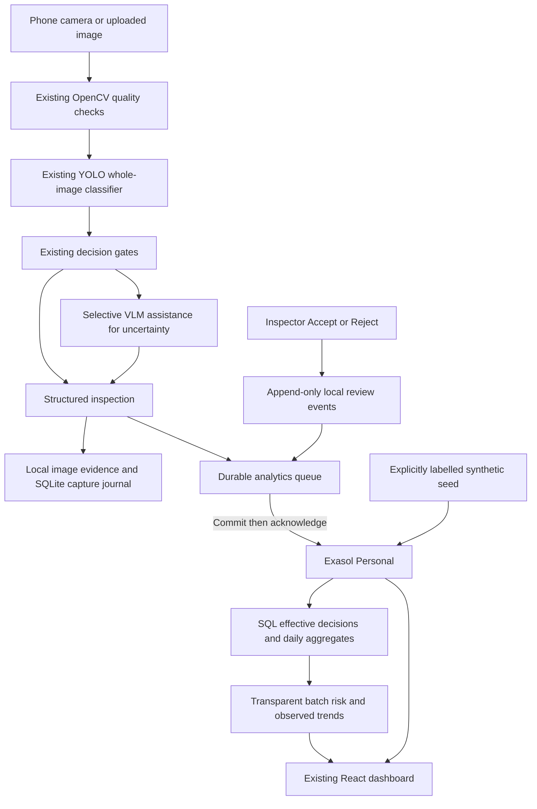

# Extend-Quality architecture

Exasol owns hackathon analytics: grouped counts, batch/machine reject rates, temporal aggregation and source filtering. SQLite is the capture journal and outage queue. It is not used as an analytics fallback in the Exasol panel. Images stay local; model evidence and human decision remain separate. Human review overrides current disposition in both local history and Exasol's effective view. Original model status is retained.

## Data semantics

- `prototype_inspection`: an actual run of the prototype, not ground-truth factory quality.
- `synthetic_demo`: deterministic demonstration rows with no model confidence or fabricated VLM inference.
- Eligible denominator: effective ACCEPT + REJECT; REVIEW/RECAPTURE/SYSTEM_HOLD are unresolved.
- Human decision takes precedence if available; otherwise the automated disposition is used. Thus this is a disposition rejection rate, not independently measured defect prevalence.
- Image-quality score measures capture suitability; it is never renamed product quality.
- No numerical severity field is manufactured from unvalidated labels. Categories and inspector evidence remain available for action.
- Rule score: `100 * (0.8 * reject_rate + 0.2 * unresolved_rate)`, at least 20 terminal decisions. Low <20; elevated >=20; high >=40. These thresholds are demonstrative policy, not learned/calibrated production limits.
- Trend: last two observed UTC daily periods, each with >=20 terminal decisions; rising/falling if rate differs by >5 percentage points. This is not a forecast; no time-series sensor or failure dataset exists.
- Wilson 95% interval is a binomial descriptive aid. Repeated component photos undermine independence; it is not a confidence interval for factory failure risk.

## Failure semantics

Local capture is saved first. Exasol failure leaves a pending record and explicit save status. Retrying uses immutable inspection IDs; acknowledgements occur after the database commits. Human reviews are local append-only events; Exasol stores the latest dated review and refuses stale updates. Outbox enqueue failure is explicitly `queue_failed`, not saved. The prototype is a local single-operator tool; public multi-user deployment requires authentication, authorization and production concurrency design.

The APIs expose no database passwords, query text, provider keys, raw SQLite file or raw image directory. Only processed images and overlays are served. SQL values are escaped with the official PyExasol formatter; schema identifiers are constrained.
